# PAssist
 <!--  --> 

PAssist is an Android application to assist you while doing on-call duties.
The name PAssist is the short form of Pikett-Assist ('Pikett' is the Swiss German term for on-call).

PAssist works for SMS based alerting systems.

## Features
### PAssist is controlled by your calendar
PAssist activates and deactivates itself based on your calendar. All supervision features are only running, when PAssist is activated.
PAssist activates some time (configurable pre-/ post-run time) before and keeps activated some time after the events start and stop time. 
This ensures you won't miss an alert in case of a small time discrepancy between the operations center time and your phone time.
All calendar events matching a configured title pattern are considered as on-call events. 
PAssist shows you an overview with all future on-call events on the calendar tab.

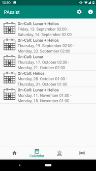

### Alarming
If an SMS is received from your configured operations center, PAssist will race an alert. 
It is playing a configured ringtone and starts a vibration pattern until you confirm it with a swipe button.
When confirmed, an acknowledge SMS is send back to your operations center. 
The alarm goes into the confirmed alarm state and can be finally closed when all your support activities are completed.

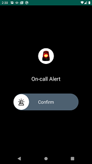
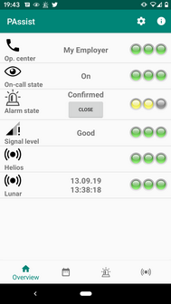

### Alarm log
PAssist creates an alarm log with the start and end time of each incident. 
All SMS messages received between start and end time are attached to the alarm in the log.
On the alert log tab you see all your passed alerts in an overview. Selecting an entry shows the details of an
alert incident including current state, reaction time to confirm, duration from start to end and all received SMS messages.
The alert log can be exported/imported from/to the external file system.    

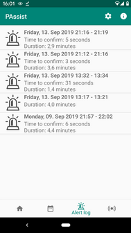
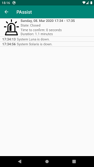

### Phone signal strength
PAssist will supervise the phone signal strength and notifies you with a vibration pattern if the signal strength 
is bad or off (includes airplane mode). 
This ensures that you won't stay in a dead spot without recognize it during on-call duties. 

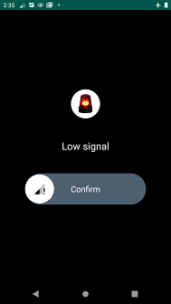
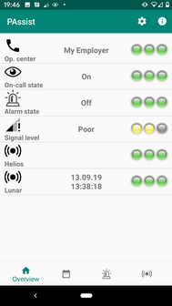
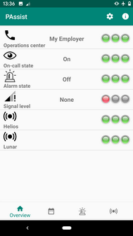

### Ringtone volume
PAssist can control the ringtone volume during on-call duty with separate profiles for day and night. 

### Test alarms
If the SMS alarming system in use sends daily test alarms to verify the alarming chain from end to end, PAssist can be
configured to automatically receive and acknowledge them, without interrupting the user.
On a configured daily check time, PAssist verifies if the expected test alarms have been received. If not, PAssist will
race an alert with a configured ringtone and starts a vibration pattern until you confirm the missing test alarm with a swipe button.
Test alarms can be configured for different contexts, as your alarming system may send a test alarms for various systems 
that are under supervision.

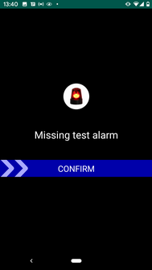
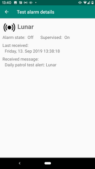

## Installation

### App-Stores
PAssist can be installed from [Google&nbsp;Play](https://play.google.com/store/apps/details?id=com.github.frimtec.android.pikettassist) or [IzzyOnDroid](https://apt.izzysoft.de/fdroid/index/apk/com.github.frimtec.android.pikettassist).

### Self build
Build PAssist on your own and then install the APK via ADB to your android phone.

### SMS permissions
In order to perform the functions of PAssist, PAssist needs to be able to receive and send SMS.
As these SMS permissions are no more granted by Google, a compatible SMS adapter is required.

Currently the only supported SMS adapter is [secure-sms-proxy](https://github.com/frimtec/secure-sms-proxy/blob/master/README.md).
PAssist will guide you to install this SMS adapter.  
 
## Configuration 
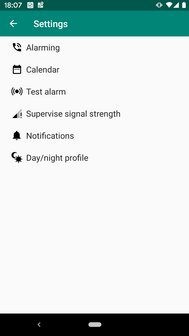

### Main settings

#### Operations center
Defines the contact of your operations center sending alarms via SMS.
The SMS received from any phone number of this contact are supervised by PAssist. 

#### Send confirmation replies
Enable or disable whether confirmation replies should be sent back to the operations center.
If the warning system of your operations center does not support confirmation messages, you can deactivate this setting to save the cost of sending the extra reply SMS.

#### Confirmation reply
Defines the text to send back as alarm acknowledgement to your operations center.
       
#### Alarm ringtone
Defines the ringtone that is used to alert for on-call alarms.

#### Calendar filter
Defines one specific or all of your calenders, that should be used to look for on-call events. 

#### Event filter
Defines a [Regular expression](https://en.wikipedia.org/wiki/Regular_expression) pattern (case insensitive) to 
match the titles of your calendar events, which should be considered for your on-call duties.

#### Pre- /post-run time
Time in seconds to enable/disable the on-call state before and after the calender event.
The default is 300 seconds (five minutes). 
    
#### Supervise signal strength
Defines whether the signal strength is supervised or not.

#### Minimal signal strength
Defines the lowest accepted signal strength level.

#### Signal filter
Defines the amount of seconds for which the signal strength must be lower than the minimal expected level before a low signal alarm is raced.
With filtering you can reduce false alarms.
The filter can be set between 0 (filtering off) and 10 minutes, with a default of 30 seconds.
Be aware: With higher values, it takes longer until you are notified of a dead spot.
Even with filtering enabled, the airplane mode is detected immediately. 

#### Alert with notification
Defines whether an alert for low signal strength creates a notification or not.
The phone also shows a low signal strength through a vibration pattern, regardless of this setting.   

#### Supervised subscription (for Dual SIM only)
For dual SIM phones you can select the subscription for which the signal strength is supervised.

### Test alarm settings 
#### Use test alarms
Enable or disable the test alarm feature.

#### Test alarm message pattern
[Regular expression](https://en.wikipedia.org/wiki/Regular_expression) pattern to identify SMS alarm messages as test alarms (case sensitive).  
_WARNING_: Be careful, if the pattern is not well designed and triggers for a real alarm, you won't be alerted!

The regular expression can define a group to extract the test context (for example the name of the system) out of the SMS.
As an example the following regular expression could handle test alarms from two different systems 'Helios' and 'Lunar':

`^Test alarm for system (Helios|Lunar).*`

Test alarms of each group can be supervised individually.
 
#### Test contexts to supervise
Defines which of the available test contexts should be supervised.

#### Check time
Defines the daily time on which the check occurs whether the test alarms have been received recently or not.

#### Test alarm time window
Defines the time window in which the test alarm must have been received before the check time to be accepted. 

#### Check days
Defines the weekdays on which the test alarms are checked.

#### Missing test alarm ringtone
Defines the ringtone that is used to alert for missing test alarms.

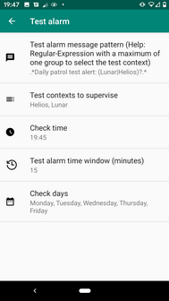

### Day/night profile settings
#### Profile start times
Time when day/night profile starts.

#### Ringtone volume
Defines whether PAssist should control the ringtone volume during on-call duty or not.
The desired ringtone volumes can be defined for the day and night profile separably.
If activated, the ringtone volume is automatically restored to the former value, when on-call duty is finished.

#### Battery drain
Enable "Minimize at night" to reduce power drain at night by reducing the check interval for the signal strength monitoring.   

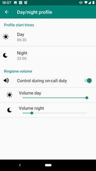

## Supported languages
Currently the following languages are supported in PAssist:
* English
* German

## Open-Source and free
PAssist is Open-Source and available under Apache-2.0 licence.
If you find PAssist useful and use it on a regular basis for your on-call duties, a voluntary donation is warmly welcome.

## Disclaimer
The use of PAssist is at your own risk. The author assumes no liability for malfunctions of the application.
Any warranty claims are excluded.

## Development
PAssist is developed with [Android-Studio 4.0](https://developer.android.com/studio) with Java 8.
The current Android target SDK is 30 (Android 11-R) and the minimal SDK is 24 (Android 7.0-Nougat).

## Used libraries
* [Swipe-Button](https://github.com/ebanx/swipe-button)
* [ThreeTenABP](https://github.com/JakeWharton/ThreeTenABP) (java.time backport for SDK 24 and 25)
* [preferencex-android](https://github.com/takisoft/preferencex-android)
* [Secure-SMS-Proxy API](https://github.com/frimtec/secure-sms-proxy)

## Devices compatibility
* https://github.com/frimtec/pikett-assist/wiki/Device-compatibility

## Feedback
Feedback, bug reports or feature requests are very welcome.
You can send an email to [frimtec@gmx.ch](mailto:frimtec@gmx.ch) or [open an issue on GitHub](https://github.com/frimtec/pikett-assist/issues).

## Credits
* [bakito](https://github.com/bakito): For implementing dual SIM support and excellent testing support.
* [IzzySoft](https://github.com/IzzySoft): For offering PAssist on IzzyOnDroid F-Droid repository.
