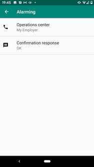
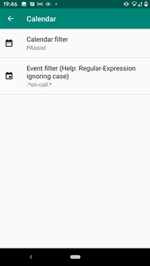
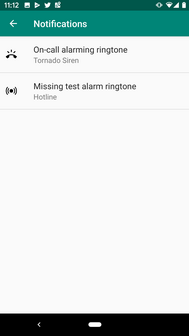

# PAssist
 
<!--  -->

PAssist is an Android application to assist you while doing on-call duties.
The name PAssist is the short form of Pikett-Assist ('Pikett' is the Swiss German term for on-call).

PAssist works for SMS based alerting systems.

## Features
### PAssist is controlled by your calender
PAssist activates and deactivates itself based on your calendar. All supervision features are only running, when PAssist is activated.
PAssist activates five minutes before and keeps activated five minutes after the events start and stop time. 
This ensures you won't miss an alert in case of a small time discrepancy between the operations center time and your phone time.
All calendar events matching a configured title pattern are considered as on-call events. 
PAssist shows you an overview with all future on-call events on the calendar tab.

### Alarming
If an SMS is received from your configured operations center, PAssist will race an alert. 
It is playing a configured ringtone and starts a vibration pattern until you confirm it with a swipe button.
When confirmed, an acknowledge SMS is send back to your operations center. 
The alarm goes into the confirmed alarm state and can be finally closed when all your support activities are completed.

### Alarm log
PAssist creates an alarm log with the start and end time of each incident. 
All SMS messages received between start and end time are attached to the alarm in the log.
On the alert log tab you see all your passed alerts in an overview. Selecting an entry shows the details of an
alert incident including current state, reaction time to confirm, duration from start to end and all received SMS messages.

### Phone signal strength
PAssist will supervise the phone signal strength and notifies you with a vibration pattern if the signal strength it 
is bad or off (includes airplane mode). 
This ensures that you won't stay in a dead spot without recognize it during on-call duties. 

### Test alarms
If the SMS alarming system in use sends daily test alarms to verify the alarming chain from end to end, PAssist can be
configured to automatically receive and acknowledge them, without interrupting the user.
On a configured daily check time, PAssist verifies if the expected test alarms have been received. If not, PAssist will
race an alert with a configured ringtone and starts a vibration pattern until you confirm the missing test alarm with a swipe button.
Test alarms can be configured for different contexts, as your alarming system may send a test alarms for various systems 
that are under supervision.

## Installation
### Google-Play
PAssist is in the process to be published on Google-Play.
The link will follow as soon as available.

Unfortunately this is not a walk in the park (see [issue #11](https://github.com/frimtec/pikett-assist/issues/11)). 
PAssist requires SMS permissions which are classified as highly sensitive by Google.
If you are experienced in the app verification process of Google, please let me know if you could support me.   

### Install pre build APK
You can download the APK file from the [GitHub release page](https://github.com/frimtec/pikett-assist/releases).
To install the APK you need to disable "Play Protect" in "Google Play" for the time of the installation (don't forget to re-enable "Play Protect" after the installation). This is only required for the first installation. Updates can be installed with "Play Protect" enabled.
Once installed PAssist will inform you when updates are available and initiates the download on request.

### Self build
Build PAssist on your own and then install the APK via ADB to your android phone.

## Configuration 

The configuration is split into four blocks:

### Alarming

#### Operations center
Defines the contact of your operations center sending alarms via SMS.
The SMS received from any phone number of this contact are supervised by PAssist. 

#### Confirmation response
Defines the text to send back as alarm acknowledgement to your operations center.
   

    
### Calendar  
#### Calendar filter
Defines one specific or all of your calenders, that should be used to look for on-call events. 

#### Event filter
Defines a [Regular expression](https://en.wikipedia.org/wiki/Regular_expression) pattern (case insensitive) to 
match the titles of your calendar events, which should be considered for your on-call duties.

    
### Test alarm  
#### Test alarm message pattern
[Regular expression](https://en.wikipedia.org/wiki/Regular_expression) pattern to identify SMS alarm messages as test alarms (case sensitive).  
_WARNING_: Be careful, if the pattern is not well designed and triggers for a real alarm, you won't be alerted!

The regular expression can define a group to extract the test context (for example the name of the system) out of the SMS.
As an example the following regular expression could handle test alarms from two different systems 'Helios' and 'Lunar':

`^Test alarm for system (Helios|Lunar)?.*`  

Test alarms of each group can be supervised individually.
 
#### Test contexts to supervise
Defines which of the available test contexts should be supervised.

#### Check time
Defines the daily time on which the check occurs whether the test alarms have been received recently or not.

#### Test alarm time window
Defines the time window in which the test alarm must have been received before the check time to be accepted. 

#### Check days
Defines the weekdays on which the test alarms are checked.

### Notifications
#### Alarm ringtone
Defines the ringtone that is used to alert for on-call alarms.

#### Missing test alarm ringtone
Defines the ringtone that is used to alert for missing test alarms.

#### Supervise signal strength
Defines whether the signal strength is supervised or not.

## Supported languages
Currently the following languages are supported in PAssist:
* English
* German

## Open-Source and free
PAssist is Open-Source and available under Apache-2.0 licence.
If you find PAssist useful and use it on a regular basis for your on-call duties, a voluntary donation is warmly welcome.

## Disclaimer
The use of PAssist is at your own risk. The author assumes no liability for malfunctions of the application.
Any warranty claims are excluded.

## Development
PAssist is developed with [Android-Studio 3.5](https://developer.android.com/studio) with Java 8.
The current Android target SDK is 29 (Android 10-Q) and the minimal SDK is 25 (Android 7.1-Nougat).

## Used libraries
* [proSwipeButton](https://github.com/shadowfaxtech/proSwipeButton)
* [ThreeTenABP](https://github.com/JakeWharton/ThreeTenABP) (java.time backport for SDK 25)

## Feedback
Feedback, bug reports or feature requests are very welcome.
You can send an email to [frimtec@gmx.ch](mailto:frimtec@gmx.ch) or [open an issue on GitHub](https://github.com/frimtec/pikett-assist/issues).
