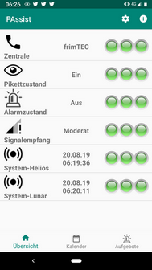
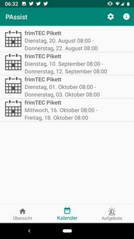
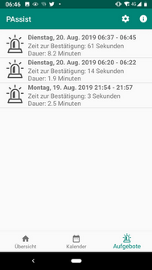

# PAssist
 
<!--  -->

PAssist is an Android application to assist you while doing on-call duties.
The name PAssist is the short form of Pikett-Assist ('Pikett' is the Swiss German term for on-call).

PAssist is works with SMS based alerting systems.

## Features
* PAssist activates and deactivates itself based on your calendar. All calendar events with a configured title pattern are considered.
* PAssist shows you your future on-call calender events.
* When on-call, PAssist does the following:
  * Creates an alarm if an SMS is received from your configured operations center, and acknowledges the alarm with a replay SMS when confirmed.
  * Supervises the telephone signal strength and notifies you with vibration if it is bad or switched off.
  * Optional: Automatically acknowledges test alarms (identified with a configured SMS message pattern) and notifies you when expected test alarms are missing.     
    This feature can be used if your alarming systems sends periodic test alarms to ensure that the alarming chain works end to end.
* Creates an alarm log with start and end time of each incident. All SMS received during the incident are attached to the alarm in the log.

## Installation
### Google-Play
PAssist is in the process to be published on Google-Play.
The link will follow as soon as available.

Unfortunately this is not a walk in the park (see [issue #11](https://github.com/frimtec/pikett-assist/issues/11)). 
PAssist requires SMS permissions which are classified as highly sensitive by Google.
If you are experienced in the app verification process of Google, please let me know if you could support me.   

### Install pre build APK
You can download the APK file from the [GitHub release page](https://github.com/frimtec/pikett-assist/releases).
To install the APK you need to disable "Play Protect" in "Google Play" for the time of the installation (don't forget to re-enable "Play Protect" after the installation).

### Self build
Build PAssist on your own and then install the APK via ADB to your android phone.

## Configuration 
The configuration is split into the following blocks:
* Alarming
  * Operations center: Contact of your operations center sending alarms via SMS.
  * Confirmation response: Text to send back as alarm confirmation to your operations center.
  
* Calendar
  * Calendar filter: Defines one or all of your calenders that should be used to look for on-call events. 
  * Event filter: [Regular expression](https://en.wikipedia.org/wiki/Regular_expression) pattern (case insensitive) to detect the events that are relevant for on-call.
    
* Test alarm
  * Test alarm message pattern: [Regular expression](https://en.wikipedia.org/wiki/Regular_expression) to identify the SMS alarm message as a test alarm (case sensitive). 
    WARNING: Be careful, if the pattern is not well designed and triggers for a real alarm, you won't be alerted!
    The regular expression can use a group to extract the test context (for example the name of the system) out of the SMS.
    As an example the following regular expression could handle test alarms from two different system Helios and Lunar: `^Test alarm for system (Helios|Lunar)?.*`  
    Test alarms of each group can be supervised individually. 
  * Test contexts to supervise: Defines which test context should be supervised. Before you can see a context to select, a first test alarm with the specific test context must be received.
  * Check time: Time of the day when it is checked that test alarms has been received recently for all selected test contexts.
  * Test alarm time window: Time window in which the test alarm must have been received before the check time. 
  * Check days: Weekdays on which the test alarms are checked.

* Notifications
  * Alarm ringtone: Defines the alarm ringtone to be used. 
  * Supervise signal strength: Decides if the signal strength is supervised or not.

## Open-Source and free
PAssist is Open-Source and available under Apache-2.0 licence.
PAssist is published as a free application on Google-Play.
If you find PAssist useful and use it on a regular basis for your on-call duties, a voluntary donation via In-App purchase is warmly welcome.

## Disclaimer
The use of PAssist is at your own risk. The author assumes no liability for malfunctions of the application.
Any warranty claims are excluded.

## Development
PAssist is developed with [Android-Studio 3.5](https://developer.android.com/studio) with Java 8.
The current Android target SDK is 29 (Android 10-Q) and the minimal SDK is 26 (Android 8.0-Oreo). 

## Feedback
Feedback, bug reports or feature requests are very welcome.
You can send an email to [frimtec@gmx.ch](mailto:frimtec@gmx.ch) or [open an issue in GitHub](https://github.com/frimtec/pikett-assist/issues).
